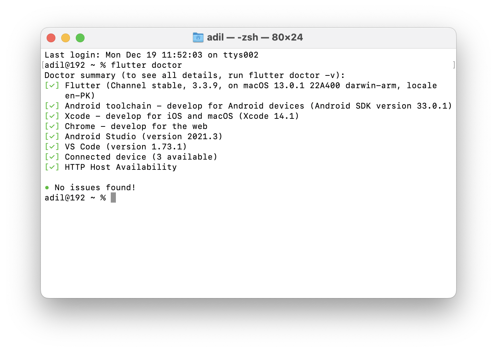
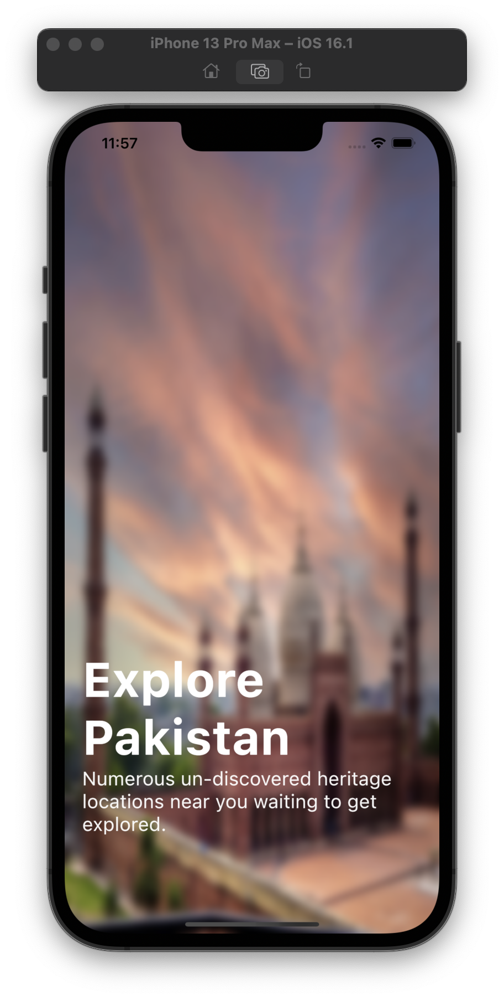
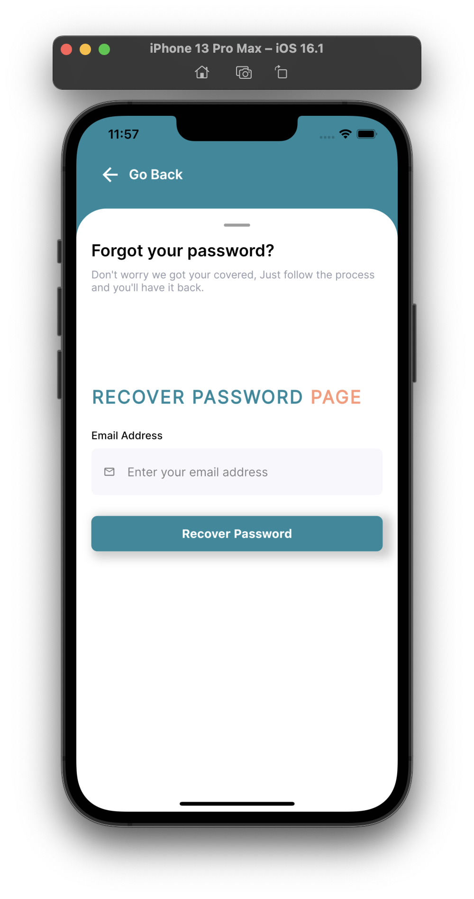
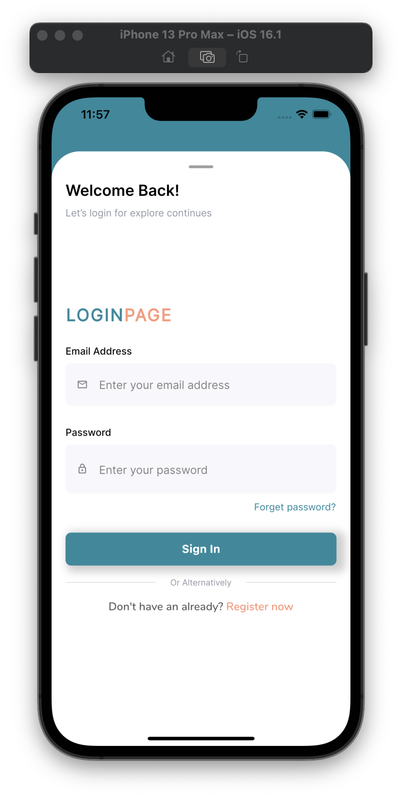
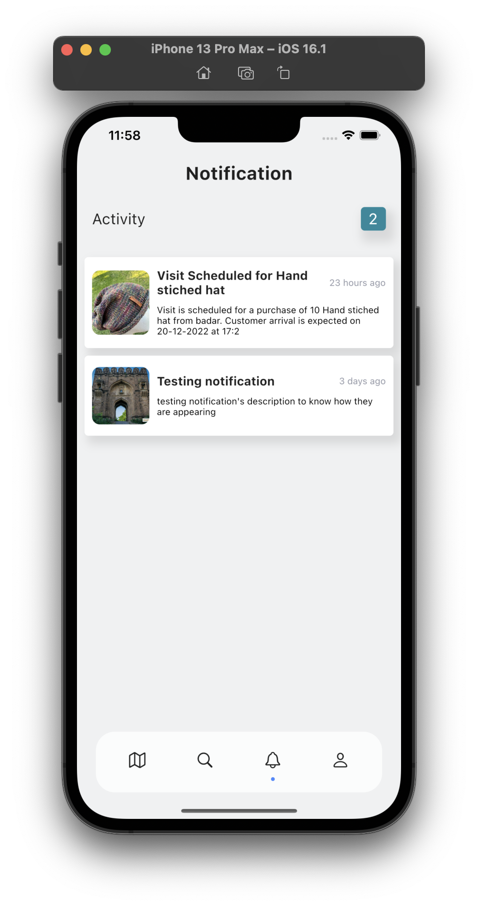
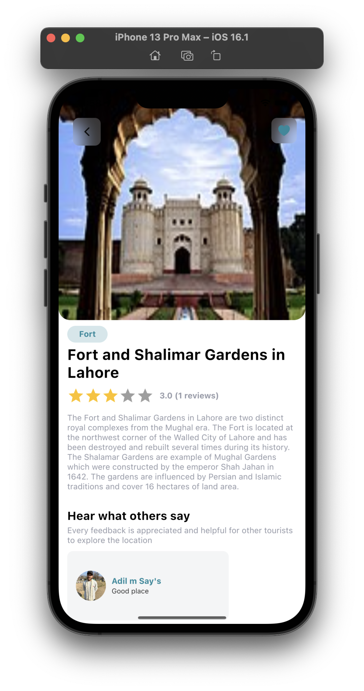
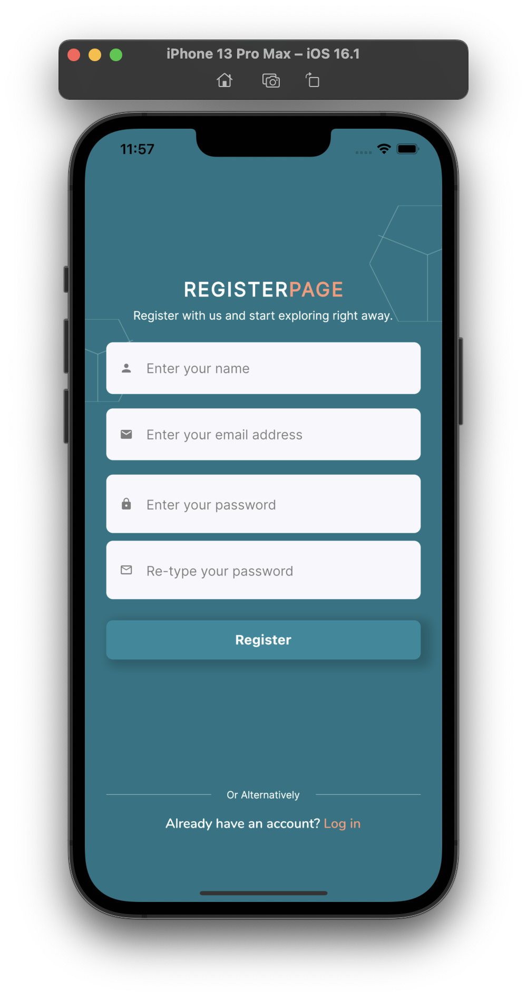
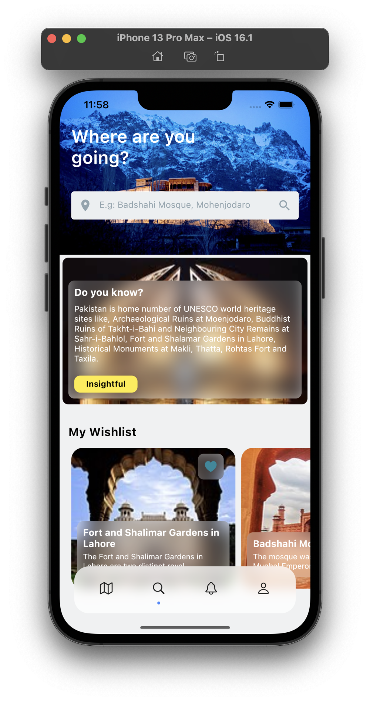

# the_pak_tours

PakTours, Tourist exploration mobile application to inform user about nearby heritage locations. Connected with admin panel, sellers and hotels for convenience of tourist to shop, explore and enjoy. More features included are below:

[Android APK](https://drive.google.com/file/d/1eCNvNju_X3NwOwg3uTnj4mBUAAumrogs/view?usp=share_link)

Development Environment:

    

  

    

 

    

 

    

 

    

 

    

 

    

 

    

 

    

